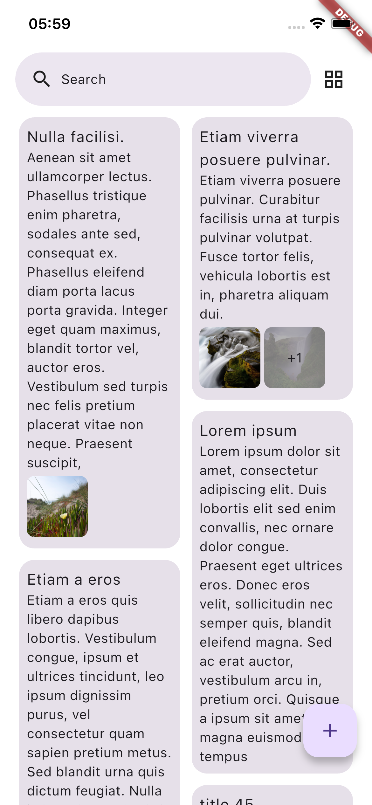
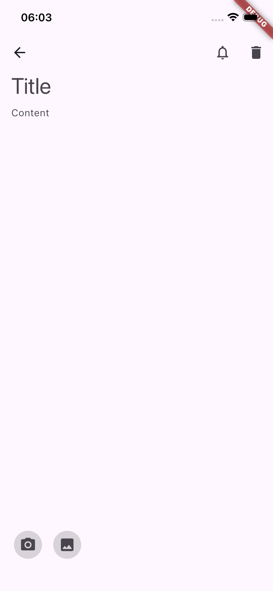
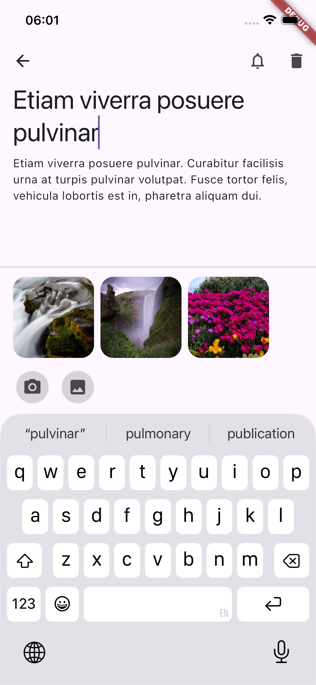
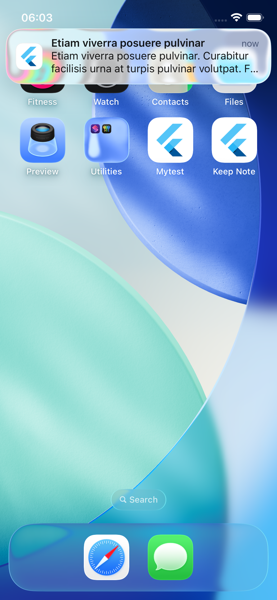

# Keep Note Flutter

A cross-platform note-taking application built with Flutter, inspired by Google Keep.

It follows Clean Architecture principles and primarily uses official Flutter packages along with
Flutter Favorite packages, including:
* **Bloc** for state management and clear separation of business logic from the UI code
* **go_router** for navigation and deep linking
* **get_it** for dependence injection
* **freezed** for generating immutable data classes, unions/sealed classes, and boilerplate-free `copyWith`, `toString`, and `equality`
* **shared_preferences** for local storage of simple data
* **sqflite** for local SQLite database storage of complex data
* **infinite_scroll_pagination** for pagination
* **flutter_local_notifications** for scheduling and displaying local notification

## Project Structure
```
lib/
├── config/di/          # Dependency injection setup
├── data/               # Data sources and repositories
├── domain/             # Entities and use cases
├── presentation/       # Screens, widgets, and UI logic (Bloc providers, etc.)
├── routing/            # App navigation and routes (GoRouter)
└── main.dart           # Application entry point
```

## Screenshots
#### Listing Screen
 


#### Edit & Notification Screen
 

 
